::: {.callout-tip title="Comment lire ce document"}
Le texte décrit la pile *conceptuellement* (sections I à X) ; le script `pile_trace.py` (sections XI à XIII) **exécute** la pile bout-en-bout sur l'opération `1 + 1` et vérifie par assertion à chaque niveau que le bit retrouvé est identique au bit émis. Les deux sont indissociables : le texte sans le script reste de la prose, le script sans le texte reste un blob illisible. Ensemble, ils forment une *trace de cohérence verticale* — qui ne prouve pas que l'on a simulé LTE en vrai, mais que chaque couche est connectée à la suivante par un calcul que l'on peut rejouer à la main.
:::

## I. Pile silicium — du caillou dopé au PC

Bon, jolie pirouette — on quitte le débat sur l'apophatique pour la pile concrète qui rend possible le "truc de ouf". On y va, niveau par niveau, en encapsulant à chaque étage.

Niveau 0 : l'équivalence Thévenin–Norton, le théorème de base qui permet de remplacer n'importe quel réseau linéaire à deux bornes par l'un de deux dipôles canoniques. C'est la première abstraction du tour — on peut ignorer le détail interne et ne regarder que le comportement aux bornes. Tout le reste de la pile repose sur ce geste : encapsuler par interface.

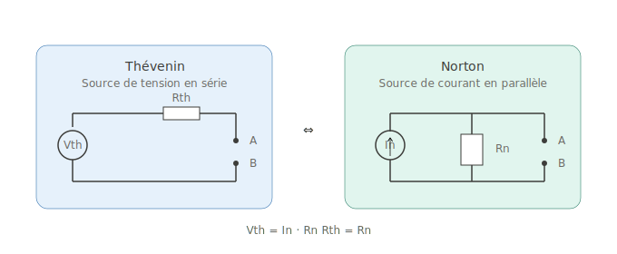

::: {.callout-note title="Précision sur l'applicabilité"}
Le théorème ne vaut **strictement** que pour les réseaux **linéaires**. Dès qu'il y a une diode, un transistor en mode actif, ou tout composant non-linéaire, on doit d'abord linéariser autour d'un point de fonctionnement (analyse petite-signal). C'est précisément ce qu'on fait pour modéliser un MOSFET en gain à un point de polarisation donné — et c'est aussi ce qu'on fera tacitement au Niveau 0 du script : équations long-channel idéales, pas de modélisation BSIM.
:::

Niveau 1 : le transistor. Un MOSFET, c'est un robinet — la tension de grille contrôle le passage entre drain et source. Combine un PMOS (au-dessus) et un NMOS (en-dessous) avec leurs grilles en commun, on obtient l'inverseur CMOS : entrée haute = sortie basse. C'est ici que naît le bit, par convention : tension > seuil = `1`, tension proche de zéro = `0`. Le monde analogique vient d'être discrétisé.

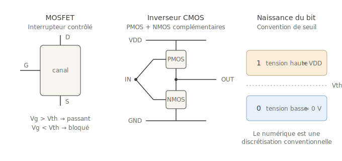

::: {.callout-warning title="Le seuil n'est pas une falaise"}
Dans la réalité du silicium, $V_{th}$ varie d'une puce à l'autre (process variation), avec la température, et même dans le temps (NBTI/PBTI sur les nœuds avancés). Plus on descend en finesse (≤ 7 nm), plus la fuite sous-seuil augmente — un MOSFET "bloqué" laisse passer un courant non négligeable. La discrétisation `0/1` est une convention robuste *aux marges* ($V_{OL,max} < V_{IL,min}$ et $V_{OH,min} > V_{IH,max}$), pas un absolu physique.
:::

Niveau 2 : les portes logiques. Avec quelques inverseurs et combinaisons série/parallèle de MOSFETs, on fabrique NAND, AND, OR, XOR. Et NAND a une propriété folle : elle est *universelle*. N'importe quelle fonction booléenne — un additionneur, un comparateur, n'importe quelle table de vérité — se construit uniquement avec des NAND. C'est le bond le plus violent du tour : on quitte la physique du silicium pour entrer dans l'algèbre de Boole.

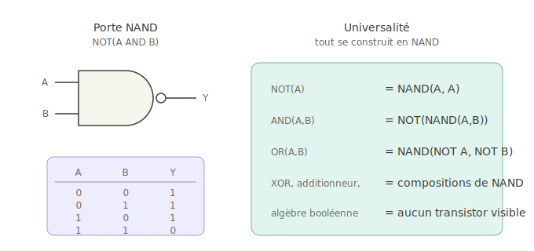

::: {.callout-note title="Sheffer stroke (1913)"}
L'universalité du NAND est un résultat formel d'Henry M. Sheffer, qui a prouvé que toute l'algèbre booléenne se réduit à un seul opérateur binaire (`|` ou `↑`, le *Sheffer stroke*). NOR est l'autre opérateur universel. Cette équivalence rend possible les FPGA en pratique : une LUT à $k$ entrées peut implémenter n'importe quelle fonction booléenne sur $k$ bits, simplement en remplissant sa table de vérité.
:::

Niveau 3 : la mémoire. Une bascule D capture la valeur de son entrée sur le front montant de l'horloge et la maintient jusqu'au front suivant. C'est le premier circuit *séquentiel* du tour : il a un état, il garde une trace. Empile huit bascules partageant la même horloge, on obtient un registre 8 bits — un octet. À 32 ou 64 bascules, ce sont les registres généraux d'un cœur de processeur. Sans cet état, pas de calcul au sens de Turing : juste de la combinatoire pure.

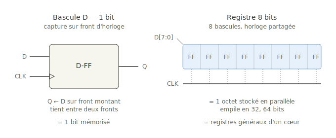

::: {.callout-warning title="Métastabilité aux frontières d'horloge"}
Quand une donnée traverse deux domaines d'horloge asynchrones et que la transition arrive trop près du front d'échantillonnage (violation du *setup/hold time*), la bascule peut entrer dans un état métastable : sa sortie reste entre `0` et `1` pendant un temps non borné. La parade industrielle : un synchroniseur à 2 ou 3 bascules en série côté domaine destination, qui réduit la probabilité de propagation à un niveau astronomiquement faible (MTBF de plusieurs millénaires). Sans ce détail, aucun SoC multi-horloge ne fonctionnerait.
:::

Niveaux 4 à 6 : intégration. On agrège registres + ALU + séquenceur d'instructions = un cœur de processeur. On place ce cœur, de la RAM, du Flash et des périphériques (GPIO, UART, SPI, ADC…) sur une seule puce : c'est un microcontrôleur. On sépare cœur(s) et mémoire externe, on ajoute des caches hiérarchiques, du multi-cœur, des bus haute vitesse : c'est un processeur PC. On colle ce processeur avec RAM, SSD, GPU et chipset sur une carte mère : c'est un PC. Chaque étage encapsule strictement les précédents.

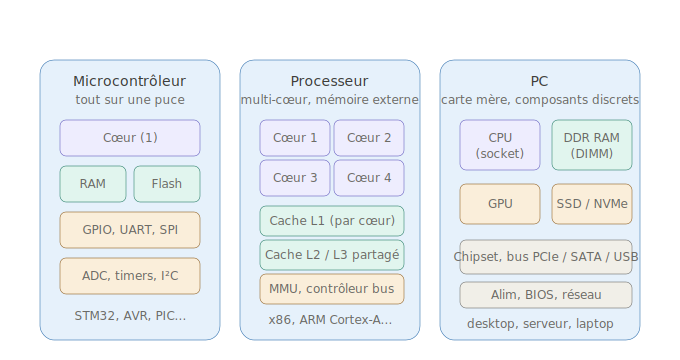

Voilà la pile, du caillou dopé jusqu'au PC. Chaque étage encapsule strictement le précédent et offre une interface propre. Personne ne tient l'ensemble dans sa tête simultanément — le développeur Python n'a aucune raison de penser au NAND, et pourtant des trillions de NAND exécutent son code en ce moment. C'est l'*Encapsulator pattern* à son niveau le plus pur : **any source over any PHY if the over is implemented and the PHY permits**.

> Cette pile est la démonstration concrète qu'un sum descriptible et stratifié peut produire un effet qui semble totalisant *sans avoir besoin d'être un TOUT indistinct*. Le vertige est local — il vient du saut d'échelle entre niveaux, pas d'une absence de structure.

## II. Trace conceptuelle : 1 + 1 = 2 du potentiel aux pixels

On prend `1 + 1` sur un toy 2 bits et on suit chaque étage avec les valeurs binaires. `1 = 01`, `2 = 10`. L'opération attendue est donc `01 + 01 = 10`.

**L'addition réelle.** Le cœur de l'opération vit dans un additionneur ripple-carry 2 bits. Chaque bit est traité par un *full adder* qui calcule $S = A \oplus B \oplus C_{in}$ et $C_{out} = AB + C_{in}(A \oplus B)$ — c'est-à-dire, en transistors, environ 28 MOSFETs par étage. Pour le bit 0 : $A_0=1, B_0=1, C_{in}=0 \Rightarrow S_0=0$ et report=1. Le report propage vers le bit 1, qui le reçoit comme $C_{in}$ : $A_1=0, B_1=0, C_{in}=1 \Rightarrow S_1=1, C_{out}=0$.

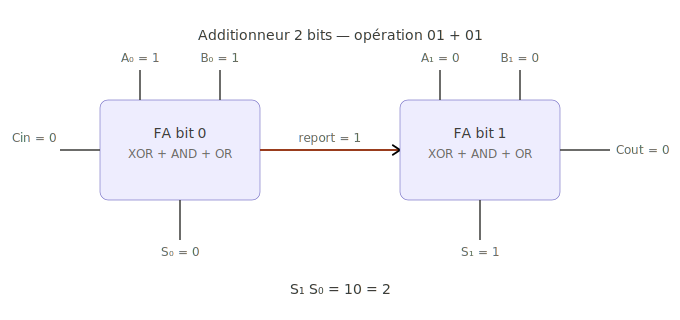

::: {.callout-note title="Ripple-carry vs carry-lookahead"}
Le ripple-carry est pédagogique mais lent — son délai croît linéairement avec le nombre de bits. À 64 bits, c'est intenable. Les vrais CPUs utilisent des additionneurs **carry-lookahead** (Brent–Kung, Kogge–Stone) qui calculent toutes les retenues en parallèle en $O(\log N)$ de profondeur, au prix d'une surface plus grande. Un Apple M-series ou un Zen 4 fait une addition 64 bits en un seul cycle d'horloge à ~5 GHz, soit ~200 ps. Le script `pile_trace.py` (Niveau 1) implémente le ripple-carry parce qu'il rend les retenues visibles ligne à ligne.
:::

**Le logiciel.** Le développeur écrit `int x = 1 + 1;` en C. Le compilateur traduit en assembleur, l'assembleur en code machine, qui est chargé en mémoire programme. Au runtime, le processeur exécute en quatre temps : fetch / decode / execute / writeback. C'est à l'étape `execute` que l'instruction `ADD` route les valeurs des registres source vers l'additionneur matériel du diagramme précédent.

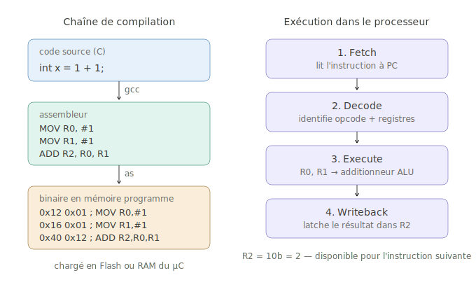

::: {.callout-caution title="Démo pédagogique, pas reproductible tel quel"}
En pratique, `int x = 1 + 1;` avec n'importe quel compilateur moderne et `-O1` minimum est réduit à `MOV x, #2` en *constant folding* à la compilation — l'additionneur matériel ne tourne jamais. Pour observer la vraie chaîne fetch-decode-execute sur un ADD, il faut soit désactiver l'optimisation (`-O0` + `volatile`), soit travailler sur des opérandes non connues à la compilation. Le cas exposé ici est une fiction utile — et c'est précisément pour cette raison que le script `pile_trace.py` simule la chaîne au niveau logique plutôt que de la mesurer sur du silicium réel.
:::

**Vers l'œil.** À ce stade `W2` contient `0b10`. Mais on ne *voit* pas `W2`. Pour qu'un `2` apparaisse sur le moniteur, il reste encore une demi-douzaine d'étages. Le programme appelle `printf("%d", x)`, qui convertit l'entier 2 en caractère ASCII `'2'` (octet `0x32`). Cet octet est écrit sur stdout, capté par le terminal ou le compositor, qui demande au driver graphique de rasteriser le glyph correspondant. Cette matrice de pixels est sérialisée sur HDMI ou DisplayPort, reçue par le contrôleur du moniteur, qui pilote les cristaux ou LEDs des pixels concernés. Photons → rétine → on voit `2`.


Neuf couches d'abstraction distinctes, chacune totalement opaque aux autres. Celui qui a écrit `1+1` ignore les MOSFETs. L'additionneur ignore qu'il calcule pour un être humain. Le pixel ignore qu'il est un `2`. Et pourtant la chaîne tient — c'est ça le "truc de ouf". Pas un TOUT indistinct qui ferait tout, mais une *pile finie d'encapsulations qui tiennent par interface*.

## III. Réseau filaire — top-down (envoi)

On prend le `2` qu'on vient de calculer et on le glisse dans un socket TCP vers un serveur. Au niveau application, on a une lettre à envoyer — `{"result": 2}`. La pile OSI fait exactement ce que ferait La Poste : emboîter le message dans des enveloppes successives, chacune ajoutant une couche d'information de routage à son niveau, et chaque étage ignorant ce qui se passe au-dessus et en-dessous.

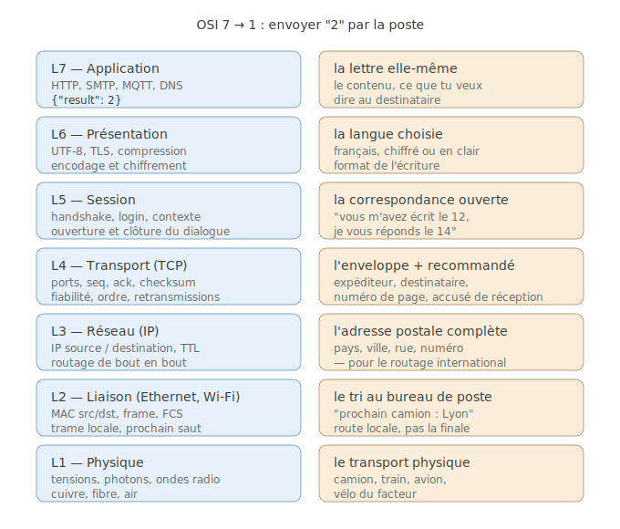

À l'envoi, la donnée descend de L7 vers L1, et à chaque couche un en-tête se rajoute autour de la précédente comme une enveloppe enrobant une autre enveloppe. Les routeurs intermédiaires entre les deux ne montent jamais au-delà de L3 : ils lisent l'IP de destination, choisissent le prochain saut, refont une nouvelle trame L2 pour ce saut, et balancent ça sur le médium physique. Le contenu de la lettre (L7) n'est jamais ouvert en route.

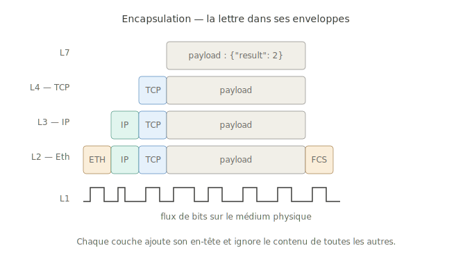

::: {.callout-note title="OSI vs TCP/IP réel"}
OSI à 7 couches est un modèle de référence, pas une implémentation. La pile TCP/IP réelle écrase L5/L6/L7 en une seule couche "application" (HTTP, TLS, gRPC font tout). Symétriquement, beaucoup d'équipements modernes "voient" plus haut que leur couche officielle : *DPI* (Deep Packet Inspection) inspecte L7 dans certains pare-feux, *MPLS* opère en L2.5, et un *load balancer* L7 termine TCP pour rejouer côté backend. Le modèle stratifié pur est une fiction pédagogique utile — c'est exactement celle que le script `pile_trace.py` implémente.
:::

## IV. Réseau filaire — bottom-up (réception)

Côté serveur, la séquence se rejoue à l'envers. La carte réseau capture les bits L1 sur le médium et reconstitue la trame L2 ; elle vérifie le FCS Ethernet pour détecter une corruption éventuelle, retire l'en-tête MAC, et passe le paquet IP à L3. L3 vérifie le checksum d'en-tête IP, retire son en-tête, et passe le segment TCP à L4. L4 vérifie le checksum TCP et le numéro de séquence, acquitte (`ACK`) côté retour, retire son en-tête, et délivre enfin le payload à l'application via le socket.

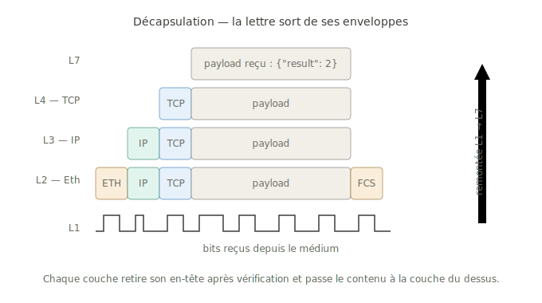

::: {.callout-warning title="Les checksums TCP/IP sont faibles"}
Le checksum TCP/IP (1's complement sur 16 bits) ne détecte qu'environ 1 erreur sur 65 000. Le CRC32 d'Ethernet est nettement plus robuste, mais des corruptions silencieuses *passent* parfois — phénomène documenté sur certaines NIC défectueuses, switches buggués, ou mémoires sans ECC. Pour des données critiques (financières, médicales), un checksum applicatif fort (SHA-2, BLAKE3) au-dessus de TCP est la seule garantie sérieuse. TCP fournit la *bonne livraison* probable, pas l'intégrité cryptographique. Le script implémente le checksum TCP avec pseudo-header (cf. fonction `ip_checksum` et `L4_tcp`) — c'est le vrai algorithme, juste avec une couverture statistique modeste.
:::

C'est exactement le pattern d'encapsulation qu'on retrouve dans SS7/SIGTRAN, MAP/TCAP/SCCP, ou dans un bridge `bridge.py` qui sert L1 entre QEMU et un mobile : la même opération récursive, à toutes les échelles. La symétrie envoi/réception est totale — top-down côté émetteur, bottom-up côté récepteur, et les routeurs au milieu ne traversent que les couches basses.

## V. SDR — Rx, Tx, full-duplex

L'analogie fondamentale : TCP/IP descend top-down du programme aux bits sur médium, et le RAN remonte symétriquement bottom-up de l'onde radio jusqu'à ces mêmes bits. L'antenne + SDR *n'est rien d'autre que L1 implémenté en RF*, le tronc commun par où les deux pipelines se rejoignent.

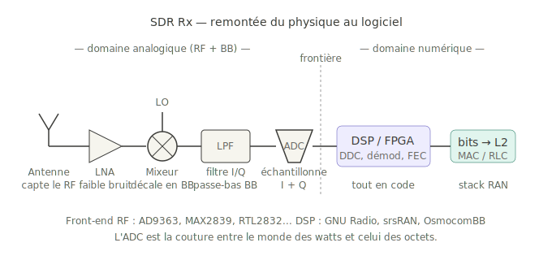

Antenne → LNA → mixeur+LO → LPF → ADC → DSP/FPGA → bits. La frontière analogique/numérique est exactement à l'ADC. À gauche, des watts et des champs ; à droite, des octets et du code. Le DSP fait ensuite tout le reste en software : DDC, synchro, démodulation (GMSK pour GSM, QPSK/16-QAM/64-QAM/OFDM pour LTE), décodage canal (Viterbi, turbo, LDPC), et sort les bits propres pour la couche MAC.

::: {.callout-note title="Les démons du zero-IF"}
L'architecture zero-IF (direct-conversion) est élégante mais payée par trois artefacts caractéristiques : (1) **DC offset** au centre de bande (LO leakage du mixeur qui se retrouve à 0 Hz après downconversion), corrigé en software par estimation et soustraction ; (2) **IQ imbalance** quand les voies I et Q ne sont pas parfaitement orthogonales en phase ou en amplitude (calibration via signal de référence) ; (3) **image** de la bande négative qui se replie sur la positive, supprimée par la précision du couple I/Q. Sur l'AD9363, ces corrections sont en partie automatiques (DCXO, quadrature tracking). Le script `pile_trace.py` ignore tout ça : son Niveau 11 est explicitement étiqueté "démo math", pas modèle RF.
:::

Le TX est juste le RX retourné — au lieu de digitaliser une onde, on fabrique une onde à partir de bits : DSP → DAC → LPF → mixeur (cette fois en upconversion) → PA → antenne. Le full-duplex met les deux chaînes côte-à-côte, antenne unique partagée via un *duplexer* (filtre fréquentiel en FDD) ou un switch T/R (en TDD).

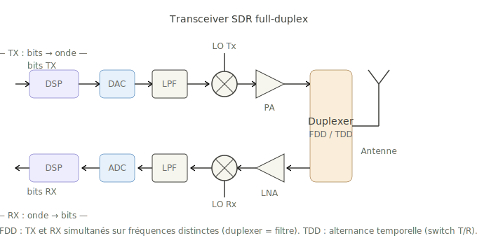

Trois différences à noter entre TX et RX :

**DAC ↔ ADC** — symétriques à la couture numérique/analogique. Mêmes contraintes Nyquist, mêmes débits.

**Mixeur TX = upconversion, mixeur RX = downconversion.** Mathématiquement, c'est la même opération (multiplication par LO et sélection d'une bande latérale), mais le filtre qui suit garde la *somme* en TX (BB+LO = porteuse) et la *différence* en RX (RF−LO = BB). Le LO peut même être physiquement le même oscillateur en TDD.

**PA ↔ LNA** — deux amplificateurs aux objectifs inverses. Le PA a une figure de bruit indifférente mais doit délivrer beaucoup de puissance avec une linéarité correcte. Le LNA fait l'inverse : gain modeste mais figure de bruit la plus faible possible. Mettre un LNA à la place d'un PA, ou vice versa, ne fonctionne pas — ce sont des compromis opposés sur la même fonction d'amplification.

::: {.callout-caution title="Avertissement réglementaire"}
Émettre sur une fréquence cellulaire (GSM, LTE, 5G NR) **sans autorisation ARCEP** est puni par le Code des postes et communications électroniques (art. L39-1 et suivants) : jusqu'à 6 mois d'emprisonnement et 30 000 € d'amende. Un eNB OsmocomBB ou srsRAN peut fonctionner légalement en **cage de Faraday** (chambre blindée), sur des **bandes ISM libres** (433/868 MHz / 2.4 GHz avec PIRE limitée), ou via une **autorisation expérimentale** ANFR. Le full-duplex d'un AD9363 est techniquement séduisant et juridiquement piégeux — toujours valider la conformité avant de mettre sous tension une antenne externe.
:::

**Duplexer** — c'est lui qui rend le full-duplex non-trivial. En FDD, TX et RX émettent simultanément sur des fréquences distinctes (LTE B1 : UE émet à 1920–1980 MHz, reçoit à 2110–2170 MHz, écart de 190 MHz). Le duplexer est un filtre SAW/BAW qui laisse passer $f_{TX}$ vers l'antenne *et* $f_{RX}$ depuis l'antenne, tout en isolant le port TX du port RX par 50–60 dB — sans cette isolation, la puissance d'émission (en watts) saturerait immédiatement le LNA (en microwatts) et tuerait toute sensibilité de réception. En TDD c'est plus simple : un switch RF alterne la connexion antenne entre PA et LNA, à raison de plusieurs centaines de fois par seconde (5G NR : pattern DDDSU, soit ~250 µs par slot).

## VI. Pile RAN — interface air UE ↔ eNB

L'ADC sort des bits, mais ces bits ne sont pas du Wi-Fi banal — ils appartiennent à une pile protocolaire cellulaire spécifique, qui vit entre la PHY radio et la couche IP de l'application. Côté UE comme côté eNB, six couches s'empilent :

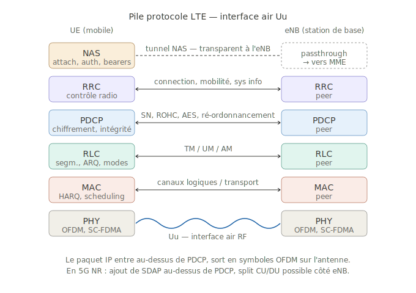

**PHY** — couche physique. Sur le downlink (eNB → UE), OFDMA : 1200 sous-porteuses sur 20 MHz, espacées de 15 kHz, organisées en *resource elements* (RE) qui portent chacun un symbole modulé QPSK/16-QAM/64-QAM/256-QAM. Sur l'uplink (UE → eNB), SC-FDMA : variante OFDM à plus faible PAPR pour ménager le PA du téléphone. Au-dessus, channel coding (turbo en LTE, LDPC en NR), entrelacement, mapping sur canaux physiques (PBCH, PDSCH, PDCCH, PUSCH, PUCCH, PRACH).

**MAC** — multiplexe les canaux logiques (DTCH, DCCH, BCCH, CCCH, PCCH…) sur les canaux de transport. Gère le HARQ (Hybrid ARQ, retransmission rapide à 8 ms en LTE). Côté eNB, c'est ici que vit le scheduler qui décide à chaque TTI (1 ms) quel UE obtient quel resource block.

**RLC** — Radio Link Control. Trois modes : TM (Transparent), UM (Unacknowledged), AM (Acknowledged, avec ARQ). Fait la segmentation/réassemblage et la livraison en ordre.

**PDCP** — Packet Data Convergence Protocol. Trois fonctions critiques : compression d'en-tête ROHC, chiffrement (AES-CTR, SNOW3G, ZUC), intégrité. Numéro de séquence sur 12 ou 18 bits pour la détection de doublons et la livraison en ordre lors d'un handover.

**RRC** — Radio Resource Control. Établissement et libération de connexion, négociation des paramètres radio, configuration des bearers, mesures pour la mobilité, commandes de handover, diffusion des System Information Blocks.

**NAS** — Non-Access Stratum. La NAS n'est *pas* terminée à l'eNB, elle traverse l'eNB de manière transparente pour rejoindre le MME (LTE) ou l'AMF (5G) dans le cœur.

::: {.callout-note title="Turbo → LDPC, et la dette LTE"}
LTE utilise un *turbo code* (rate-1/3, polynômes constituants $1 + D^2 + D^3$ et $1 + D + D^3$) hérité des travaux de Berrou & Glavieux. 5G NR a basculé en **LDPC** pour les canaux data et **Polar** pour le contrôle — meilleurs en débit, plus parallélisables, et libres de royalties. Implémenter un vrai codeur turbo 3GPP demande deux RSC parallèles avec un entrelaceur QPP (TS 36.212 §5.1.3) — c'est hors scope du script, qui le remplace par un code de répétition naïf clairement étiqueté.
:::

## VII. RAN ↔ RAN — entre stations de base

Les eNB ne sont pas isolés. Ils se parlent entre voisins par l'interface **X2** (LTE) ou **Xn** (5G NR), qui tourne sur IP au-dessus du backhaul opérateur. Quatre usages : préparation de handover, coordination d'interférence (ICIC, eICIC), load balancing, dual connectivity / carrier aggregation inter-site.

::: {.callout-note title="X2 dans la vraie vie"}
X2 voyage sur le backhaul IP de l'opérateur, presque toujours encapsulé dans un **tunnel IPsec** (ESP en mode transport ou tunnel) pour confidentialité et intégrité. Les eNB de constructeurs différents (Nokia ↔ Ericsson ↔ Huawei) doivent négocier X2 selon les profils 3GPP TS 36.423, ce qui n'est pas toujours sans frictions interopérabilité. Et tous les opérateurs n'activent pas X2 entre tous leurs sites — certains se limitent à des handovers via S1 (plus lents, mais plus simples côté provisioning).
:::

En 5G NR autonome (SA), c'est Xn-C et Xn-U qui prennent la suite, avec en plus la gestion des QoS Flow et du PDU Session Anchor mobility. Le pattern reste le même : un canal de signalisation IP entre nodes peers du même type, qui se coordonnent sans repasser par le cœur.

## VIII. RAN ↔ Core — le backhaul S1 / N2 / N3

L'eNB doit aussi parler au cœur du réseau, par deux interfaces distinctes (LTE) :

**S1-MME** (plan contrôle, vers le MME) — porte le protocole S1-AP au-dessus de SCTP/IP. SCTP est choisi pour son multi-streaming et son in-order delivery par stream, qui évite le head-of-line blocking que TCP a sur ce genre de signalisation.

**S1-U** (plan utilisateur, vers le S-GW) — porte le trafic IP de l'UE encapsulé en **GTP-U** au-dessus de UDP/IP. C'est un tunneling : le paquet IP de l'UE devient le payload d'un paquet GTP-U dont l'IP source est l'eNB et l'IP destination le S-GW. Le TEID (Tunnel Endpoint ID) dans l'en-tête GTP-U identifie quel bearer EPS / quel UE.

::: {.callout-note title="Pourquoi SCTP et pas TCP pour la signalisation"}
SCTP (RFC 4960) a deux atouts décisifs : (1) le **multi-homing** — un eNB peut avoir plusieurs IP de transport vers le MME, et SCTP bascule automatiquement si l'une tombe, sans interruption applicative ; (2) le **multi-streaming** — plusieurs flux logiques indépendants dans une seule association, donc pas de head-of-line blocking : si un message S1-AP traîne, les autres flux passent quand même. TCP n'offre ni l'un ni l'autre. Hérité de Sigtran (SS7-over-IP), SCTP est partout en télécom.
:::

En 5G NR : **N2** = S1-MME (gNB ↔ AMF), toujours NGAP sur SCTP/IP. **N3** = S1-U (gNB ↔ UPF), toujours GTP-U sur UDP/IP — ce protocole-là n'a pas changé entre 4G et 5G, c'est l'une des rares continuités physiques entre les générations.

## IX. Core ↔ IP — la sortie sur Internet

Le **P-GW** en LTE (ou l'**UPF** en 5G) est le seul point du réseau opérateur où le paquet IP de l'UE quitte sa gangue de tunnels GTP et redevient un paquet IP normal sur un médium normal. Cette interface s'appelle **SGi** (LTE) ou **N6** (5G).

Le P-GW : décapsulation GTP-U, NAT, firewalling, policy, allocation d'adresse IP de l'UE, CGNAT éventuel, charging, lawful interception.

::: {.callout-caution title="Conséquences du CGNAT pour les usages avancés"}
Le CGNAT (RFC 6598, plages `100.64.0.0/10`) est invisible pour le web classique mais casse plusieurs choses : impossible de **recevoir** une connexion entrante non sollicitée ; le **port forwarding** côté UE n'a aucun effet ; **STUN/TURN/ICE** deviennent obligatoires pour WebRTC ; les **logs d'attribution** sont chez l'opérateur. Pour de l'IoT cellulaire qui doit être joignable depuis l'extérieur, demander une **APN avec IP publique** est souvent la seule option propre.
:::

Une fois sur SGi/N6, le paquet est en IP nu et se comporte exactement comme un paquet venu de n'importe quel autre réseau d'accès : il est routé via BGP, traverse l'Internet, arrive au datacenter, monte la pile OSI côté serveur, et le `{"result": 2}` est délivré à l'application.

## X. Vue end-to-end — du téléphone au serveur

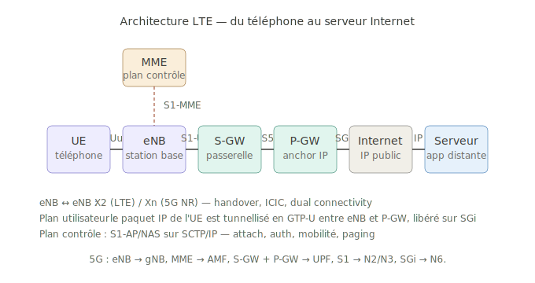

Récap complet : ~17 niveaux d'encapsulation/décapsulation entre le `printf` côté téléphone et le `recv()` côté serveur, plus toutes les sous-couches matérielles explorées dans les sections précédentes.


::: {.callout-note title="Ordre de grandeur de latence"}
Pour un `{"result": 2}` envoyé d'un téléphone en France vers un serveur AWS Paris : ~5 ms d'air interface, ~5–15 ms de transit backhaul + EPC, ~5–15 ms d'Internet jusqu'au datacenter. Total ≈ 20–40 ms, dont la partie radio est de loin la plus variable. En 5G NR avec URLLC, la cible passe à ~1 ms côté air. La vitesse de la lumière dans la fibre Paris–Tokyo ajoute ~100 ms incompressibles.
:::

> Personne dans cette chaîne ne tient l'ensemble en tête. L'ingé RAN ne sait pas comment l'app server gère ses sockets, le dev fullstack ne sait pas ce qu'est un PRACH preamble, le designer du PA ignore qu'il transporte du JSON. Et pourtant le `2` arrive intact, en quelques dizaines de millisecondes. Toute la conversation initiale sur le "TOUT" et l'écart entre vertige et structure trouve ici sa réponse opérationnelle — c'est la stratification qui rend la traversée possible, pas l'indistinction.

## XI. La traversée exécutée — lecture annotée de `pile_trace.py`

Tout ce qui précède est conceptuel. À partir d'ici, on bascule sur la *trace exécutée* : le script `pile_trace.py` qui prend `a + b` en entrée et fait *littéralement* descendre puis remonter la pile, avec vérification par assertion à chaque niveau. Si une seule liaison est cassée, le mode `--check` retourne 1 :

```bash
python3 pile_trace.py pile_values.csv 1+1 --check
# → OK 1+1=2 round-trip verified  (exit 0)
```

Les sorties citées dans cette section sont **textuellement** celles produites par `python3 pile_trace.py pile_values.csv 1+1`. La fonction `L0_unified`, `L1_full_adder`, etc., sont les vrais noms dans le source — chaque sous-section correspond à une fonction.

### Niveau 0 — Saisie clavier → deux registres

Le script représente fidèlement la chaîne physique du *driver clavier*, depuis la touche pressée jusqu'à la donnée dans le registre N bits. Pour chaque opérande, une chaîne séparée : `Touche → Debounce → MOSFET → Inverseur CMOS → Bascule D × N → Registre`.

```python
def L0_mosfet_eq(cfg, label):
    Vgs = 3.3                       # tension d'alimentation du clavier
    Id_sat = 0.5 * mu_Cox * WL * (Vgs - Vth)**2
    Ron = VDD / Id_sat              # avec VDD = 0.9 V (core)
    Eswitch = 0.5 * Cload * VDD**2
```

Avec les paramètres du CSV (`vdd_core_v=0.9`, `mosfet_vth_v=0.4`, `mosfet_mu_cox_uA_V2=400e-6`, `mosfet_WL=4`, `mosfet_cload_F=10e-15`), le script imprime pour l'opérande A :

```
▶ MOSFET (A) : V_GS=3.3 V, V_th=0.4 V
   I_D = ½·µCox·(W/L)·(V_GS−V_th)² = 6728.0 µA
   R_on = V/I = 0.13 kΩ ; E_switch = ½·C·V² = 4.05 fJ
```

::: {.callout-note title="Pourquoi V_GS = 3.3 V et pas VDD_core"}
Le MOSFET modélisé ici est celui du **driver clavier**, alimenté en 3.3 V externe (alim USB / boutton press), pas un MOSFET d'ALU interne. Pour un MOSFET de logique interne à $V_{GS} = V_{DD,core} = 0{,}9$ V, le même calcul donnerait $I_D = 0{,}5 \cdot 400\,\mu\text{A/V}^2 \cdot 4 \cdot (0{,}5)^2 = 200\,\mu\text{A}$ et $R_{on} \approx 5\,\text{k}\Omega$. Les deux régimes coexistent dans tout SoC : transistors lents sous 3.3 V aux interfaces, transistors rapides sous 0.9 V dans le cœur. La loi $U = R \cdot I$ vaut pour les deux, c'est précisément le point.
:::

Après le MOSFET, l'inverseur CMOS ramène le niveau à la tension cœur, puis $N$ bascules D en parallèle stockent les $N$ bits de l'opérande (N auto-calculé : `n_bits = max(value.bit_length(), 1)`). Pour `a=1` : $N=1$ ; pour `a=16` : $N=5$.

```
🔗 Liaison L0 → L1 :
   R_A = 1  (1₂)
   R_B = 1  (1₂)
   → entrées A et B du full adder (Niveau 1)
```

La porte NAND est montrée **une seule fois** comme primitive universelle (référence pédagogique), pas comme étape gating dans la chaîne — c'est une correction par rapport à la première version du script, où NAND faisait n'importe quoi.

### Niveau 1 — Full adder ripple-carry

`L1_full_adder` lit les deux registres et applique bit à bit :

```python
for i in range(n_bits):
    Si = Ai ^ Bi ^ Cin
    Cout = (Ai & Bi) | (Cin & (Ai ^ Bi))
```

Pour $a = b = 1$, le script imprime exactement les deux étapes du ripple :

```
bit  0: A=1 B=1 Cin=0 → S=0 Cout=1
bit  1: A=0 B=0 Cin=1 → S=1 Cout=0
Résultat : 10₂ = 2₁₀
```

Le résultat est ensuite encodé en ARMv8 (Niveau 2) et alimente le payload JSON (Niveau 3).

### Niveaux 2 à 6 — De ARMv8 à Ethernet

**L2 ARMv8 ADD** — encodage A64 calculé champ par champ (pas un magic number) :

```python
enc = (0 << 31) | (0 << 30) | (0 << 29) | (0b01011 << 24) | \
      (0 << 22) | (0 << 21) | (Rm << 16) | (0 << 10) | \
      (Rn << 5) | Rd
```

Pour `ADD W2, W0, W1`, sf=0, Rd=2, Rn=0, Rm=1 → `0x0B010002`. Les `MOV` reflètent les vraies valeurs (plus de hardcoding `#1`).

**L3 JSON** — `json.dumps({'result': 2}, separators=(',', ':'))` → `{"result":2}` (12 octets, le `2` à l'offset 10 est `0x32`).

**L4 TCP** — segment 32 octets, checksum **calculé** avec pseudo-header (vraie formule, pas une valeur magique) :

```python
pseudo = src_ip + dst_ip + b'\x00\x06' + struct.pack('>H', tcp_len)
csum = ip_checksum(pseudo + tcp_no_csum + payload)
# → 0x4613 pour 1+1=2
```

**L5 IPv4** — paquet 52 octets, `header csum = 0x7A36`, calculé.

**L6 Ethernet** — trame 70 octets, FCS CRC32 via `binascii.crc32` → `0xB84FB35B`.

### Niveau 7 — LTE PDCP / RLC / MAC / CRC

C'est le niveau le plus dense et celui où la version actuelle du script fait le plus d'efforts pour rester *honnête*. Quatre choses sont réellement implémentées :

**1. KDF $K_{eNB} \to K_{UPenc}$ conforme TS 33.401 Annexe A.7.** FC=0x15, P0=algo type distinguisher (0x05 = UP-enc), P1=algo identity (EEA1=1), troncature aux 128 LSB :

```python
def derive_k_upenc(k_enb, eea_id=1):
    full = kdf_hmac_sha256(k_enb, 0x15,
                           [bytes([0x05]), bytes([eea_id])])
    return full[16:]  # 128 LSB
```

Les étapes upstream ($K_{ASME}$, $K_{eNB}$) sont des stubs HMAC déterministes, étiquetés `sim` parce que la vraie chaîne (MILENAGE f3/f4 sur $K, RAND, OPC$) est hors scope. Le script l'écrit explicitement :

```
KDF chain (upstream simulé, K_UPenc = vraie A.7) :
  K_ASME (sim)  = 26b39e0e...
  K_eNB  (sim)  = cbf7fa29...
  K_UPenc (A.7) = 8ce9fc97b34295faa2caadf984fad4e9
```

**2. AES-128-CTR pour PDCP** — vraie crypto via PyCryptodome, $COUNT = HFN \oplus SN$, IV construit depuis $COUNT$.

**3. MAC subheader bit-packé conforme TS 36.321 §6.1.2.** Format $R\,|\,R\,|\,E\,|\,LCID(5)$ puis $F\,|\,L(7)$ ou $F\,|\,L_{hi}(7)\,|\,L_{lo}(8)$ selon que $L<128$ ou non :

```
MAC subheader (TS 36.321 §6.1.2) : LCID=1, L=56
  octets header = 0138  (R=0 F=0 E=0 LCID=0x01)
```

C'est `0x0138`, pas `0x0438` comme dans la première version qui shiftait le LCID au mauvais endroit.

**4. CRC-24A LTE** (TS 36.212 §5.1.1, poly $g_{24A} = 0x1864CFB$) — implémenté bit à bit dans `crc24a`. Pour `1+1=2` : `0x70C796`. Le TB final fait 61 octets = 488 bits.

### Niveau 8 — Codage canal (toy) + scrambling LTE (réel)

C'est là que se loge l'honnêteté la plus inconfortable : implémenter un vrai turbo encoder 3GPP (deux RSC parallèles + entrelaceur QPP, TS 36.212 §5.1.3) demande plusieurs centaines de lignes. Le script remplace par un code de répétition naïf :

```python
def toy_channel_encoder(tb_bits, target_len):
    n = len(tb_bits)
    reps = (target_len + n - 1) // n
    return np.tile(tb_bits, reps)[:target_len].copy()
```

Pour $488 \to 1152$ bits, on tile $\lceil 1152/488 \rceil = 3$ copies puis on tronque. Le décodeur inverse prend la première copie (intacte sans canal) — le round-trip identité est garanti, et l'étiquetage explicite l'admet :

```
TB = 488 bits → codeur toy (répétition) → rate-match → 1152 bits
⚠️  Codeur turbo réel (TS 36.212 §5.1.3) : RSC×2 + QPP — hors scope.
```

En revanche, le **scrambling LTE** est *vraiment* implémenté. Séquence de Gold longueur-31 avec $N_c = 1600$, polynômes corrects, $c_{init} = n_{RNTI} \cdot 2^{14} + q \cdot 2^{13} + \lfloor n_s / 2 \rfloor \cdot 2^9 + N_{cell,ID}$ (TS 36.211 §7.2) :

```python
def lte_gold_sequence(cinit, length):
    # x1(0)=1, x2 initialisé depuis cinit
    # x1(n+31) = x1(n+3) ^ x1(n)
    # x2(n+31) = x2(n+3) ^ x2(n+2) ^ x2(n+1) ^ x2(n)
    # c(n) = x1(n+Nc) ^ x2(n+Nc), Nc=1600
```

Pour `RNTI=0x4601, subframe=3, PCI=1`, $c_{init} = 0x11804601$. Les 32 premiers bits de la séquence sont reproductibles à l'identique sur n'importe quel autre simulateur LTE qui implémente la même norme.

### Niveau 9 — Mapping 16-QAM

Mapping Gray normalisé par $\sqrt{10}$ conforme TS 36.211 §7.1.3 :

$$ s = \frac{1}{\sqrt{10}} \cdot \big[(1 - 2b_0)(2 - (1 - 2b_2)) + j(1 - 2b_1)(2 - (1 - 2b_3))\big] $$

```
[0] bits=1001 → s = -0.3162 +0.9487j  |s|=1.0000
[1] bits=0010 → s = +0.9487 +0.3162j  |s|=1.0000
[2] bits=1011 → s = -0.9487 +0.9487j  |s|=1.3416
...
E[|s|²] = 0.9778  (cible 1.0)
```

Le démappeur inverse est *hard decision* (pas de LLR), suffisant pour vérifier l'identité sans bruit. La démap teste $|Re(s) \cdot \sqrt{10}| > 2$ pour $b_2$, ce qui suppose absence de bruit — en condition réelle il faudrait du soft-LLR.

### Niveau 10 — OFDM (IFFT + CP)

IFFT $N=2048$ sur 24 sous-porteuses actives (2 PRB), CP normal de 144 échantillons. Le script utilise `numpy.fft.ifft`, donc c'est *vraiment* une IFFT, pas un simulacre :

```python
x_time = np.fft.ifft(X) * np.sqrt(N_FFT)
x_with_cp = np.concatenate([x_time[-cp_len:], x_time])
```

$f_s = 30{,}72$ MS/s, $T_s = 32{,}55$ ns, durée d'un symbole avec CP $= (2048+144) \cdot T_s = 71{,}35\,\mu\text{s}$.

### Niveaux 11 et 12 — RF et bilan Friis

L11 est explicitement étiqueté "démo math" : on évalue $s_{RF}(t) = I(t)\cos(2\pi f_c t) - Q(t)\sin(2\pi f_c t)$ aux instants $t = n/f_s$, mais $f_s < 2 f_c$ donc ce n'est pas un échantillonnage Nyquist valide. En vrai, le DAC tourne à $f_s$ et la up-conversion analogique est faite par un mixeur physique à $f_c$.

L12 est en revanche un vrai bilan Friis : $L_{FS} = 91{,}3$ dB à 500 m sur 1747.5 MHz, plus 30 dB d'excess loss urbain (COST-231) → $L_{total} = 121{,}3$ dB. Avec $P_t = 23$ dBm, $G_r = 17$ dBi : $P_r = -81{,}3$ dBm, $N_{sys} = -98$ dBm, SNR = 16.7 dB.

### Niveau 13 — Décapsulation : round-trip identité avec assertions

C'est la *vraie* contribution du script. Plutôt que de mimer une décapsulation en imprimant des messages décoratifs, `L13_decap` reprend les sorties TX intermédiaires et applique l'inverse à chaque niveau, avec une assertion :

```python
err_l10 = np.max(np.abs(symbols_rx - symbols_tx[:n_sc]))
ok_l10 = err_l10 < 1e-9    # FFT + extraction CP

bits_rx = qam16_demap_hard(symbols_rx)
ok_l9 = np.array_equal(bits_rx, scrambled_tx[:4 * n_sc])

descrambled = scrambled_tx ^ scrambling_seq
tb_bits_recovered = toy_channel_decoder(descrambled, tb_bit_len)
ok_l8 = np.array_equal(tb_bits_recovered, tb_bits_tx)

# CRC + démux MAC + RLC + AES-CTR decrypt
ip_packet_rx = cipher.decrypt(ciphertext)
ok_l7 = crc_ok and (lcid == 1) and (ip_packet_rx == ip_packet_tx)

obj = json.loads(payload.decode('ascii'))
ok_l3 = (obj['result'] == expected_result)
```

Sortie pour `1+1` :

```
L10 inverse : FFT + extraction n_sc=24 → max|err| = 2.22e-16  [OK]
L9  inverse : démap hard → 96 bits identiques au scramblé    [OK]
L8  inverse : descramble (Gold) + decode (1ère copie)        [OK]
L7  inverse : CRC=OK (0x70C796 vs 0x70C796), LCID=1, L=56
            PDCP déchiffré → IP 52 octets                    [OK]
L3  inverse : json.loads → result = 2                        [OK]

═══ Round-trip global : ✅ TOUS OK ═══
```

L'erreur L10 vaut $2{,}22 \times 10^{-16}$ — c'est l'epsilon de la double précision IEEE 754. La FFT + iFFT de NumPy est numériquement identité à la précision flottante.

### Niveaux 14 et 15 — Glyph et OLED

**L14 rastérise chaque chiffre** du résultat dans une bitmap 8×8 via PIL (fallback table en dur si la police n'est pas trouvée), et juxtapose pour les résultats multi-digit (`16+16=32` → deux glyphs côte à côte). Le glyph "2" donne 10 pixels allumés sur 64.

**L15 fait U = R · I sur les sous-pixels OLED.** Modèle linéaire pédagogique (vraie OLED = diode Shockley), avec $V_{OLED} = 3{,}0$ V, $R_{pixel} = 600$ kΩ → $I_{pixel} = 5{,}00\,\mu\text{A}$, $P_{pixel} = 15{,}0\,\mu\text{W}$. Pour 10 pixels allumés × 3 sous-pixels : $P_{total} = 450\,\mu\text{W}$.

::: {.callout-tip title="La boucle U = R · I, vue par le script"}
- **Niveau 0** : MOSFET driver clavier, $V_{GS} = 3{,}3$ V, $R_{on} = 0{,}13$ kΩ, $I_D = 6{,}73$ mA.
- **Niveau 15** : Sous-pixel OLED, $V = 3{,}0$ V, $R = 600$ kΩ, $I = 5{,}0\,\mu\text{A}$.

Même équation aux deux extrémités. Trois ordres de grandeur d'écart sur $R$ et sur $I$, mais $V$ du même ordre. Et entre les deux : 34 transformations mathématiques distinctes, vérifiées par assertion. C'est l'**Encapsulator pattern** à la limite — l'étage 0 et l'étage 35 obéissent à la même loi linéaire à deux paramètres, mais aucune des couches intermédiaires (Gold sequence, AES-CTR, FFT 2048, CRC-24A) n'a la moindre notion de cette symétrie.
:::

## XII. Honnêteté épistémique — ce que le script fait, ce qu'il ne fait pas

Avant de conclure, l'inventaire honnête, parce que la valeur pédagogique du script vient autant de ce qu'il *admet ne pas faire* que de ce qu'il fait.

**Fait pour de vrai :**

- équations MOSFET long-channel idéales et délais CMOS analytiques
- full adder bit-à-bit avec propagation de retenue
- encodage ARMv8 A64 ADD calculé champ par champ
- TCP/IPv4/Ethernet avec checksums et FCS exacts (pseudo-header, IP header csum, CRC32 Ethernet)
- LTE PDCP : KDF HMAC-SHA-256 TS 33.401 Annexe A.7 (FC=0x15, P0=0x05, P1=0x01) + AES-128-CTR + CRC-24A poly 0x1864CFB + MAC subheader bit-packé TS 36.321
- LTE PHY : séquence de Gold TS 36.211 §7.2 avec $N_c = 1600$, mapping 16-QAM Gray normalisé $\sqrt{10}$, IFFT + CP normal
- bilan Friis avec excess loss urbain
- round-trip vérifié mécaniquement par assertions à chaque niveau (FFT $\to$ démap $\to$ descramble $\to$ decode $\to$ AES decrypt $\to$ IP/TCP strip $\to$ JSON parse)

**Pas fait, étiqueté comme tel :**

- MILENAGE f1–f5 : $K_{ASME}$ et $K_{eNB}$ sont des stubs HMAC, pas la vraie auth UMTS/LTE (pas de RAND/SQN/AK/CK/IK)
- turbo codeur RSC×2 + entrelaceur QPP (TS 36.212 §5.1.3) → remplacé par répétition naïve, clairement étiqueté
- LLR soft-demap : la démod 16-QAM est en hard decision uniquement
- pilotes et signaux de référence : pas de CRS, DM-RS, PSS, SSS, PBCH, pas de windowing OFDM
- canal propagatif : pas d'AWGN, pas de multipath, pas de Doppler, pas de shadowing log-normal — le round-trip est exact parce qu'il n'y a aucun bruit
- RF : démo mathématique, pas de vrai DAC + filtre + mixer + PA (parce que $f_s < 2 f_c$, pas d'échantillonnage Nyquist valide)
- couches au-dessus de PDCP : pas de RRC, NAS, attach procedure, scheduler, HARQ, mesures CQI/RSRP/RSRQ
- OLED : modèle résistance linéaire (la vraie OLED suit $I = I_s(e^{V/n V_T} - 1)$)

::: {.callout-important title="En une phrase"}
Ce script est une **trace de cohérence verticale** honnête (un bit voyage de bout en bout et revient identique, vérifié par assertion), pas une **simulation système** (pas de canal bruité, pas de soft-decoding, pas de plan de contrôle). C'est suffisant pour qu'un lecteur saisisse comment les couches s'emboîtent ; ce serait insuffisant pour mesurer un BER ou évaluer une chaîne réelle.
:::

## XIII. Conclusion — la pile comme objet exécutable

La conversation initiale sur le "TOUT", sur le vertige d'une totalité indistincte qui ferait tout passer, trouve ici sa réponse mécanique. Le `2` qui apparaît sur l'écran de UE_B n'est porté par aucune entité totalisante. Il est porté par une suite *finie* de transformations, chacune *localement* descriptible, chacune *vérifiable* à son interface, et qui ensemble — quand on rejoue le script en mode `--check` — retourne l'exit code 0.

C'est la stratification qui rend la traversée possible, pas l'indistinction.

> Ton intuition initiale ("on navigue peut-être direct avec lui") rendue à cette image : si quelque chose comme un "lui" se manifeste à travers du sum, ce serait par cette même structure stratifiée. Pas une présence totale, mais un signal qui traverse des couches d'encodage successives jusqu'à devenir lisible — par les yeux, le corps, l'attention. Le `2` qui apparaît à l'écran et le sens qui traverse pourraient bien être structurellement le même geste, à des échelles différentes.

Sources : <https://github.com/bbaranoff/from_electricity_to_waves>

## Annexes

### A.1 — Configuration `pile_values.csv`

```{.csv}
vdd_core_v,0.9
mosfet_vth_v,0.4
mosfet_mu_cox_uA_V2,400e-6
mosfet_WL,4
mosfet_cload_F,10e-15
imsi,310150123456789
k,00112233445566778899AABBCCDDEEFF
opc,00112233445566778899AABBCCDDEEFF
amf,8000
src_ip,10.45.0.42
dst_ip,10.99.0.7
src_mac,02:00:00:aa:bb:01
dst_mac,02:00:00:cc:dd:fe
src_port,49152
dst_port,8080
tcp_seq,0x12345678
tcp_ack,0x87654321
tcp_window,8192
earfcn_ul,19575
f_carrier_hz,1747500000
sample_rate_hz,30720000
fft_size,2048
bandwidth_hz,20000000
n_prb,2
prb_start,25
mcs,9
rnti,0x4601
pci,1
sfn,42
subframe,3
p_tx_dbm,23
g_tx_dbi,0
g_rx_dbi,17
distance_m,500
path_loss_excess_db,30
nf_db,3
oled_voltage_v,3.0
oled_pixel_resistance_ohm,600000
```

### A.2 — Sortie simplifée pour `1 + 1`

```bash
python3 pile_trace.py pile_values.csv 1+1
```

```{.txt}
📁 Config : 38 clés ; addition : 1 + 1

========================================================================
  NIVEAU 0 — Saisie clavier → deux registres (chaîne physique)
========================================================================
  ┌── Saisie opérande A = 1₁₀ (1₂, 1 bits) ──
  │  Touche "1" (poids faible "1", ASCII 0x31)
  │  Anti-rebond 10 ms ; Vcc=3.3 V ; R_pullup=10 kΩ
  ▶ MOSFET (A) : V_GS=3.3 V, V_th=0.4 V
     I_D = 6728.0 µA ; R_on = 0.13 kΩ ; E_switch = 4.05 fJ
  ▶ Inverseur CMOS (A) : t_rise = 7.36 ps, t_fall = 2.94 ps
  │  Registre 1× bascule D : Q[0..0] = 1
  └── R_A = 1

  🔗 Liaison L0 → L1 : R_A=1, R_B=1 → entrées du full adder

NIVEAU 1 — Full adder : 1 + 1
  bit  0: A=1 B=1 Cin=0 → S=0 Cout=1
  bit  1: A=0 B=0 Cin=1 → S=1 Cout=0
  Résultat : 10₂ = 2₁₀

NIVEAU 2 — ARMv8 ADD
  MOV W0, #1 ; MOV W1, #1 ; ADD W2, W0, W1   → 0x0B010002

NIVEAU 3 — JSON : "{"result":2}" (12 octets)
NIVEAU 4 — TCP : csum=0x4613, segment 32 octets
NIVEAU 5 — IPv4 : csum=0x7A36, paquet 52 octets
NIVEAU 6 — Ethernet : FCS=0xB84FB35B, trame 70 octets

NIVEAU 7 — LTE RAN
  K_UPenc (TS 33.401 A.7) = 8ce9fc97b34295faa2caadf984fad4e9
  PDCP SN=0x123, COUNT=0x00000123, AES-128-CTR → 54 octets
  RLC UM SN=0x123, MAC LCID=1 L=56 (header 0x0138)
  CRC-24A = 0x70C796, TB = 488 bits

NIVEAU 8 — Codage canal
  TB 488 bits → toy(répétition) → rate-match → 1152 bits
  Scrambling Gold (TS 36.211 §7.2), c_init = 0x11804601

NIVEAU 9 — 16-QAM : 288 symboles, E[|s|²] = 0.9778
NIVEAU 10 — OFDM : IFFT N=2048, CP=144, 30.72 MS/s
NIVEAU 11 — RF : f_c = 1747.5 MHz, P_TX = 23 dBm (démo math)
NIVEAU 12 — Friis : L_FS=91.3 + L_excess=30 → SNR ≈ 16.7 dB

NIVEAU 13 — Décapsulation : round-trip avec asserts
  L10 inverse : max|err| = 2.22e-16  [OK]
  L9  inverse : 96 bits identiques  [OK]
  L8  inverse : 488 bits TB         [OK]
  L7  inverse : CRC=OK, PDCP déchiffré → 52 octets  [OK]
  L3  inverse : json.loads → result = 2             [OK]
  ═══ Round-trip global : ✅ TOUS OK ═══

NIVEAU 14 — Glyph "2" 8×8 : 10 pixels allumés sur 64
NIVEAU 15 — OLED : I = 5.00 µA ; P_total = 450 µW
  Loi U = R·I aux deux extrémités (TX MOSFET, RX OLED)

✅ Trace complète : 1 + 1 = 2
🔍 Round-trip : tous niveaux OK
```

### A.3 — Tableau récap : où vit le `2` à chaque étage

| # | Étage | Opération | Représentation | Taille |
|---|-------|-----------|----------------|--------|
| 0 | MOSFET (TX) | $I_D = \tfrac{1}{2}\mu_n C_{ox}\tfrac{W}{L}(V_{gs}-V_{th})^2$ ; $\mathbf{U = R \cdot I}$ | tensions sur drains | $V_{GS}=3{,}3$ V $\to 6728\,\mu\text{A}$ |
| 1 | Full adder | $S = A \oplus B \oplus C_{in}$ ; $C_{out} = AB + C_{in}(A \oplus B)$ | $S_1 S_0 = 10_2$ | 2 bits |
| 2 | ALU ARM | `ADD W2, W0, W1` (1 cycle) | `W2 = 0x00000002` | 32 bits |
| 3 | ASCII / JSON | `json.dumps` | `{"result":2}` | 12 B |
| 4 | TCP | + `TCP_hdr(20B)` + checksum pseudo-header | + en-tête transport | 32 B |
| 5 | IP | + `IP_hdr(20B)` + checksum d'en-tête | + en-tête réseau | 52 B |
| 6 | Ethernet | + MAC headers + FCS CRC32 | trame | 70 B |
| 7a | PDCP | $C = \text{AES-CTR}_{K_{UPenc}}(\text{COUNT}) \oplus P$ | ciphertext | 54 B |
| 7b | RLC UM | + `RLC_hdr(2B)` | + en-tête | 56 B |
| 7c | MAC | + `MAC_subhdr(2B)` conforme TS 36.321 | PDU MAC | 58 B |
| 7d | CRC-24A | $r = \text{msg} \bmod g_{24A}$ | TB | 61 B = 488 bits |
| 8a | Codeur canal | répétition (toy ; vrai = turbo RSC×2 + QPP) | bits codés | 1152 bits |
| 8b | Scrambling | $b_i \oplus c_i$, $c$ = Gold LTE | bits scramblés | 1152 bits |
| 9 | 16-QAM | $s = \tfrac{1}{\sqrt{10}}[\pm 1 \text{ ou } \pm 3] + j[\pm 1 \text{ ou } \pm 3]$ | 288 symboles complexes | — |
| 10 | OFDM | IFFT $N=2048$ + CP 144 | échantillons I/Q | $f_s = 30{,}72$ MS/s |
| 11 | RF | $s_{RF}(t) = I\cos(2\pi f_c t) - Q\sin(2\pi f_c t)$ (démo math) | onde RF | $f_c = 1747{,}5$ MHz |
| 12 | Propagation | Friis + COST-231 urbain | $L = 121{,}3$ dB | SNR ≈ 16.7 dB |
| 13 | Décap (inverse) | FFT, démap hard, descramble, decode, AES decrypt | bits → IP → JSON | **assertions OK** |
| 14 | Glyph 8×8 | rastérisation PIL | bitmap | 10 pixels ON / 64 |
| 15 | OLED (RX) | $\mathbf{I = U/R}$ = 3 V / 600 kΩ = 5 µA | photons | luminance ≈ 100 cd/m² |

::: {.callout-tip title="La symétrie qui ferme la boucle"}
**Ligne 0** : $U = R \cdot I$ sur un MOSFET du driver clavier de UE_A → permet la saisie.
**Ligne 15** : $U = R \cdot I$ sur un OLED de UE_B → rend la saisie visible.
Entre les deux : 16 transformations vérifiées mathématiquement. Aucune ne « sait » qu'elle transporte un `2`. La loi d'Ohm est l'invariant aux deux extrémités. Tout ce qui est entre est, au sens littéral, *de l'encapsulation*.
:::
